---
## Front matter
title: "Лабораторная работа № 7"
subtitle: "Командная оболочка Midnight Commander"
author: "ОЗЬЯС Стев Икнэль Дани"

## Generic otions
lang: ru-RU
toc-title: "Содержание"

## Bibliography
bibliography: bib/cite.bib
csl: pandoc/csl/gost-r-7-0-5-2008-numeric.csl

## Pdf output format
toc: true # Table of contents
toc-depth: 2
lof: true # List of figures
lot: true # List of tables
fontsize: 12pt
linestretch: 1.5
papersize: a4
documentclass: scrreprt
## I18n polyglossia
polyglossia-lang:
  name: russian
  options:
	- spelling=modern
	- babelshorthands=true
polyglossia-otherlangs:
  name: english
## I18n babel
babel-lang: russian
babel-otherlangs: english
## Fonts
mainfont: PT Serif
romanfont: PT Serif
sansfont: PT Sans
monofont: PT Mono
mainfontoptions: Ligatures=TeX
romanfontoptions: Ligatures=TeX
sansfontoptions: Ligatures=TeX,Scale=MatchLowercase
monofontoptions: Scale=MatchLowercase,Scale=0.9
## Biblatex
biblatex: true
biblio-style: "gost-numeric"
biblatexoptions:
  - parentracker=true
  - backend=biber
  - hyperref=auto
  - language=auto
  - autolang=other*
  - citestyle=gost-numeric
## Pandoc-crossref LaTeX customization
figureTitle: "Рис."
tableTitle: "Таблица"
listingTitle: "Листинг"
lofTitle: "Список иллюстраций"
lotTitle: "Список таблиц"
lolTitle: "Листинги"
## Misc options
indent: true
header-includes:
  - \usepackage{indentfirst}
  - \usepackage{float} # keep figures where there are in the text
  - \floatplacement{figure}{H} # keep figures where there are in the text
---

# Цель работы

Цель данной работы --- освоение основных возможностей командной оболочки Midnight Commander. Приобретение навыков практической работы по просмотру каталогов и файлов; манипуляций с ними. 

# Задание

## Задание по mc

1. Изучите информацию о mc, вызвав в командной строке man mc.
2. Запустите из командной строки mc, изучите его структуру и меню.
3. Выполните несколько операций в mc, используя управляющие клавиши (операции с панелями; выделение/отмена выделения файлов, копирование/перемещение файлов, получение информации о размере и правах доступа на файлы и/или каталоги и т.п.)
4. Выполните основные команды меню левой (или правой) панели. Оцените степень
подробности вывода информации о файлах.
5. Используя возможности подменю Файл , выполните:
   - просмотр содержимого текстового файла;
   - редактирование содержимого текстового файла (без сохранения результатов
редактирования);
   - создание каталога;
   - копирование в файлов в созданный каталог.
6. С помощью соответствующих средств подменю Команда осуществите:
   - поиск в файловой системе файла с заданными условиями (например, файла
с расширением .c или .cpp, содержащего строку main);
   - выбор и повторение одной из предыдущих команд;
   - переход в домашний каталог;
   - анализ файла меню и файла расширений.
7. Вызовите подменю Настройки . Освойте операции, определяющие структуру экрана mc
(Full screen, Double Width, Show Hidden Files и т.д.)

## Задание по встроенному редактору mc

1. Создайте текстовой файл text.txt.
2. Откройте этот файл с помощью встроенного в mc редактора.
3. Вставьте в открытый файл небольшой фрагмент текста, скопированный из любого
другого файла или Интернета.
4. Проделайте с текстом следующие манипуляции, используя горячие клавиши:
   - Удалите строку текста.
   -  Выделите фрагмент текста и скопируйте его на новую строку.
   - Выделите фрагмент текста и перенесите его на новую строку.
   - Сохраните файл.
   - Отмените последнее действие.
   - Перейдите в конец файла (нажав комбинацию клавиш) и напишите некоторый
текст.
   - Перейдите в начало файла (нажав комбинацию клавиш) и напишите некоторый
текст.
   - Сохраните и закройте файл.
5. Откройте файл с исходным текстом на некотором языке программирования (например C или Java)
6. Используя меню редактора, включите подсветку синтаксиса, если она не включена,
или выключите, если она включена.

# Теоретическое введение

В табл. [-@tbl:std-dir] приведено краткое описание полезных для выполнения работы команд и клавиш.

: Описание полезных для выполнения работы команд и клавиш {#tbl:std-dir}

| Команда и клавиша    |     Действие                                                                                                               |
|----------------------|----------------------------------------------------------------------------------------------------------------------------|
| `F1`                 | Вызов контекстно-зависимой подсказки                                                                                       |
| `F2 `                | Вызов пользовательского меню с возможностью создания и/или дополнения дополнительных функций                               |
| `F3`                 | Просмотр содержимого файла, на который указывает подсветка в активной панели (без возможности редактирования)              |
| `F4`                 | Вызов встроенного в mc редактора для изменения содержания файла, на который указывает подсветка в активной панели          |
| `F5`                 | Точки монтирования для сменных носителей                                                                                   |
| `F6`                 | Перенос одного или нескольких файлов, отмеченных в первой (активной) панели, в каталог, отображаемый на второй панели      |
| `F7`                 | Создание подкаталога в каталоге, отображаемом в активной панели                                                            |
| `F8`                 | Удаление одного или нескольких файлов (каталогов), отмеченных в первой (активной) панели файлов                            |
| `F8`                 | Вызов меню mc пользователя                                                                                                 |
| `F8`                 | Выход из mc пользователя                                                                                                   |
| `touch`              |  Создание файла                                                                                                            |
| `man`                |  Получение справки по некоторой команде                                                                                    |

Более подробно об Unix см. в [@gnu-doc:bash;@newham:2005:bash;@zarrelli:2017:bash;@robbins:2013:bash;@tannenbaum:arch-pc:ru;@tannenbaum:modern-os:ru].

# Выполнение лабораторной работы

## Задание по mc

1. Изучил информацию о mc, вызвав в командной строке man mc (рис. [-@fig:001])

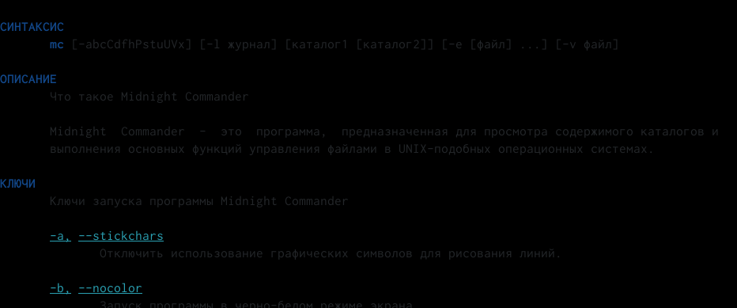{ #fig:001 width=70% }

2. Запустите из командной строки mc, изучите его структуру и меню. (рис. [-@fig:002])

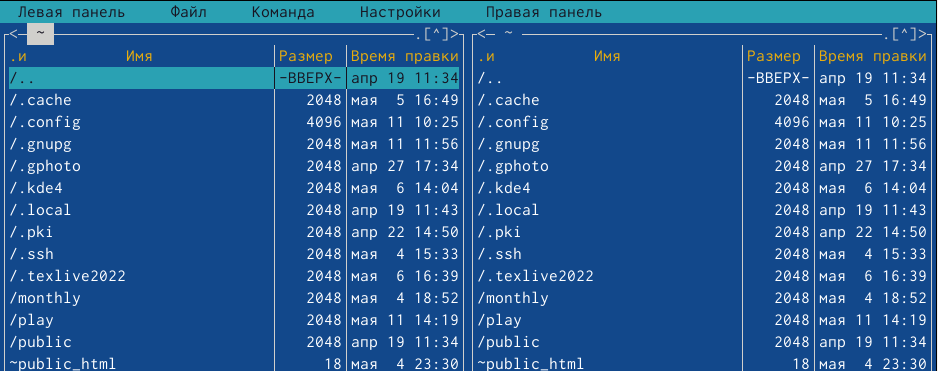{ #fig:002 width=70% }

3. Выполнил, используя управляющие клавиши (операции
с панелями: 
   1. Выделение файлов с помощью прапвой кнопки мыши (рис. [-@fig:003])
   
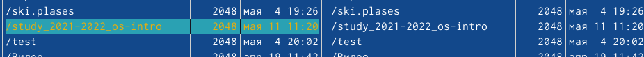{ #fig:003 width=70% }
   
   2. Отмена выделения с помощью прапвой кнопки мыши (рис. [-@fig:004])
   
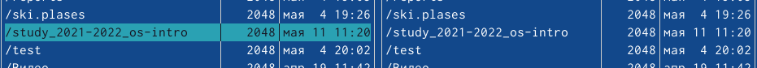{ #fig:004 width=70% }
    
   3. Копирование файлов с помощью F5 (рис. [-@fig:005]
   
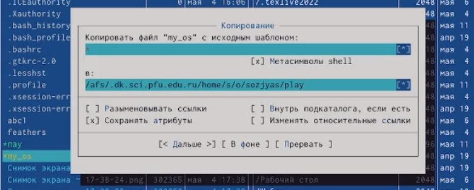{ #fig:005 width=70% }
    
   4. Перемещение файлов с помощью F6 (рис. [-@fig:006]
   
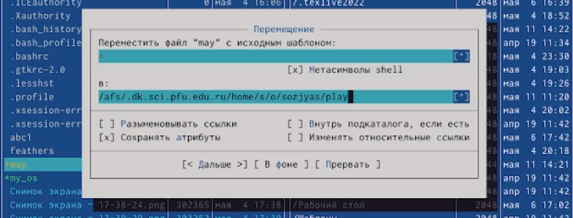{ #fig:006 width=70% }
    
   5. Получение с помощью команды Информация подменю Левая панель информации о размере и правах доступа на каталог play (рис. [-@fig:007])

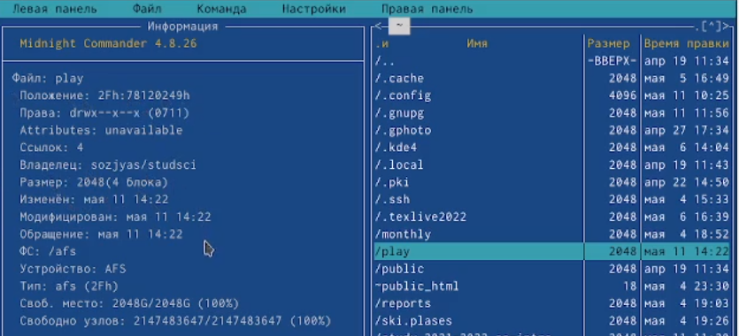{ #fig:007 width=70% }

4.  Выполнил основные команды меню левой панели:
   - Список файлов (рис. [-@fig:008])

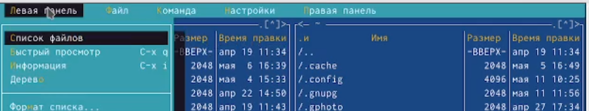{ #fig:008 width=70% }

   - Дерево каталогов (рис. [-@fig:009])

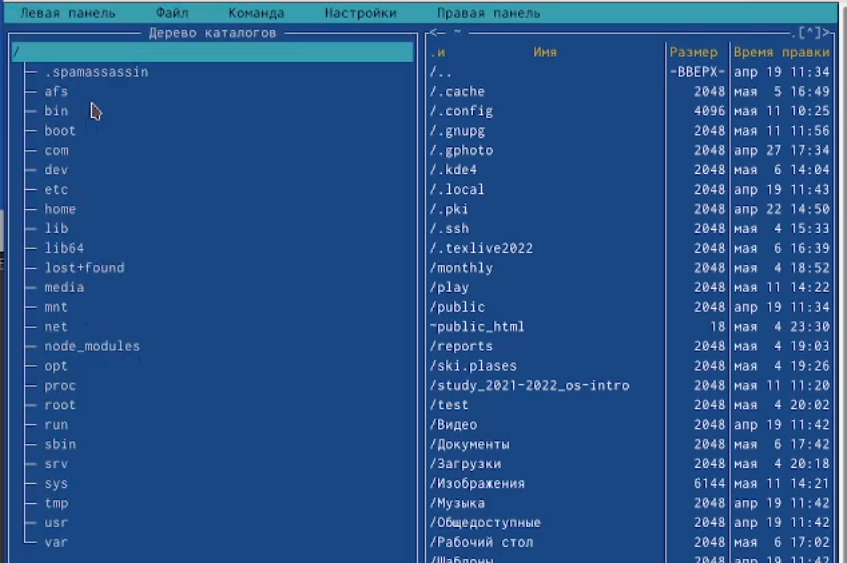{ #fig:009 width=70% }

   - Быстрый просмотр (рис. [-@fig:010])

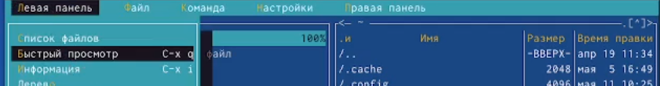{ #fig:010 width=70% }

   - Расширенный формат списка (рис. [-@fig:011])

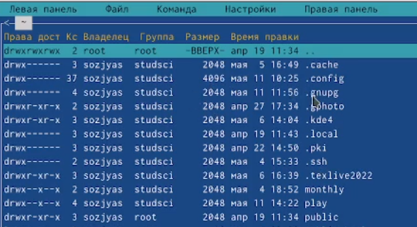{ #fig:011 width=70% }

   - Порядок сортировки (рис. [-@fig:012])

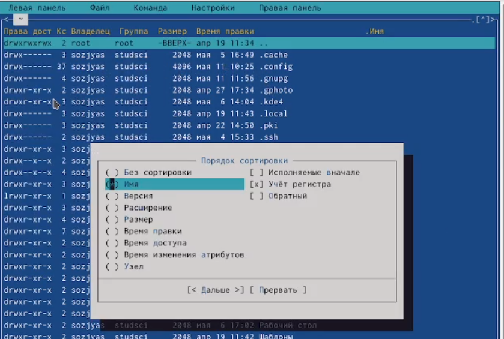{ #fig:012 width=70% } 

5. Используя возможности подменю Файл, я выполнил: 
   - Просмотр содержимого текстового файла (рис. [-@fig:013])

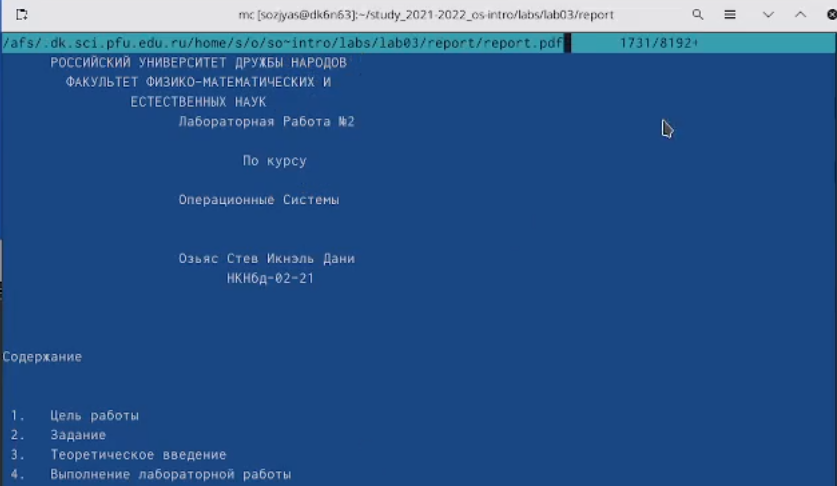{ #fig:013 width=70% }

   - Редактирование содержимого текстового файла (без сохранения результатов
редактирования); (рис. [-@fig:014])

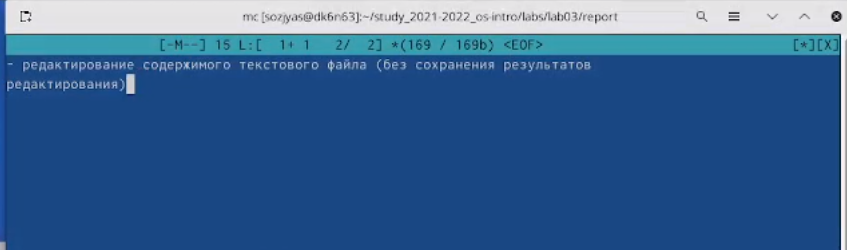{ #fig:014 width=70% }
 
   - Создание каталога; (рис. [-@fig:015])

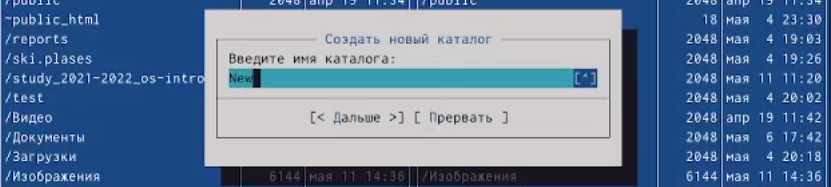{ #fig:015 width=70% }

   - Копирование файлов в созданный каталог (рис. [-@fig:016])

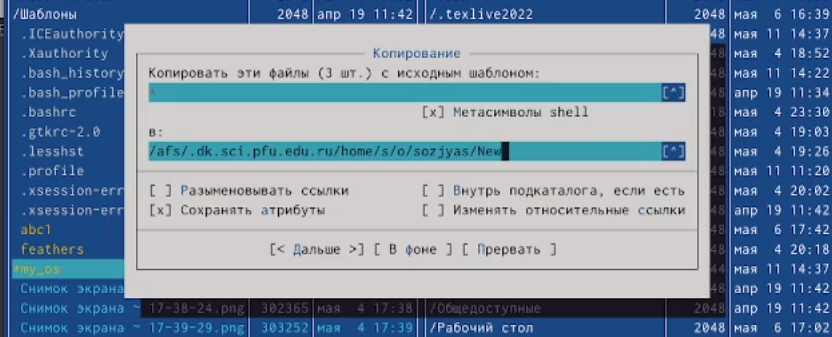{ #fig:016 width=70% }

6. Используя возможности подменю Файл, я выполнил:
   - Поиск в файловой системе файла с расширением .cpp, содержащего строку main (рис. [-@fig:017])

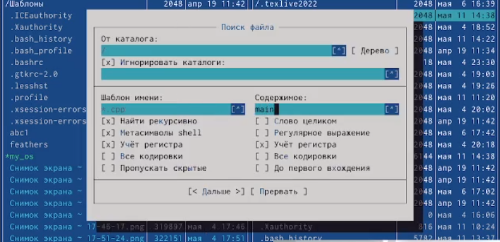{ #fig:017 width=70% }

   - Выбор и повторение одной из предыдущих команд (рис. [-@fig:018])

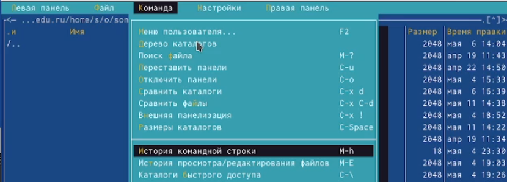{ #fig:018 width=70% }

   - Переход в домашний каталог (рис. [-@fig:019])

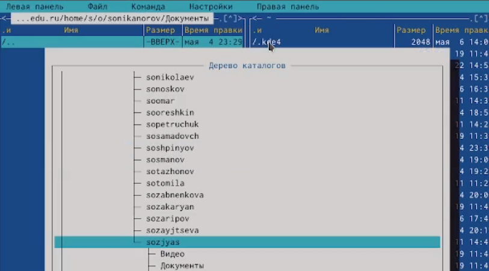{ #fig:019 width=70% }

   - Анализ файла меню (рис. [-@fig:020])

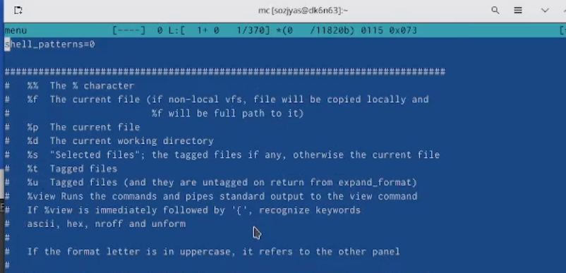{ #fig:020 width=70% }

   - И файла расширений.(рис. [-@fig:021])

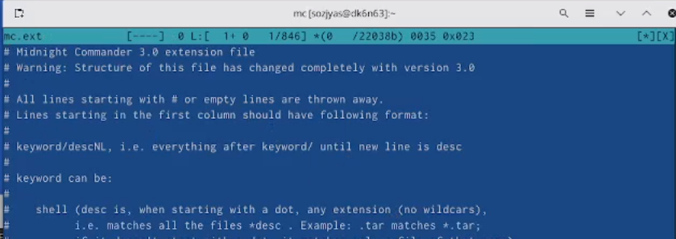{ #fig:021 width=70% }

   - Вызовил подменю Настройки и освоил операции, определяющие структуру экрана mc
(Full screen, Double Width, Show Hidden Files и т.д.) (рис. [-@fig:022])

{ #fig:022 width=70% }

##  Задание по встроенному редактору mc

  - Создал текстовой файл text.txt. (рис. [-@fig:023])
  
{ #fig:023 width=70% }

   - Открыл этот файл с помощью встроенного в mc редактора. (рис. [-@fig:024])
   
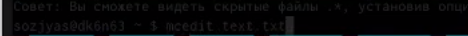{ #fig:024 width=70% }

   - Вставил в открытый файл небольшой фрагмент текста, скопированный из любого
другого файла или Интернета. (рис. [-@fig:025])
   
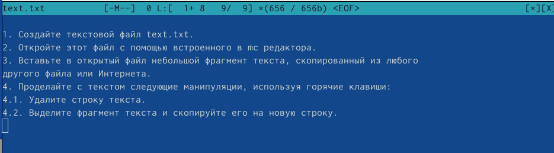{ #fig:025 width=70% }

   - Удалил строку текста. (рис. [-@fig:026])
   
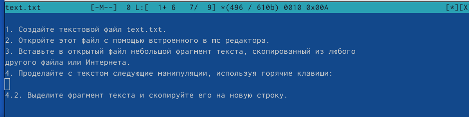{ #fig:026 width=70% }

   - Выделил фрагмент текста и скопировал его на новую строку. (рис. [-@fig:027])
   
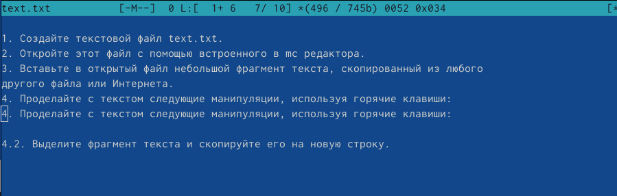{ #fig:027 width=70% }

   - Выделил фрагмент текста и перенес его на новую строку. (рис. [-@fig:028])
   
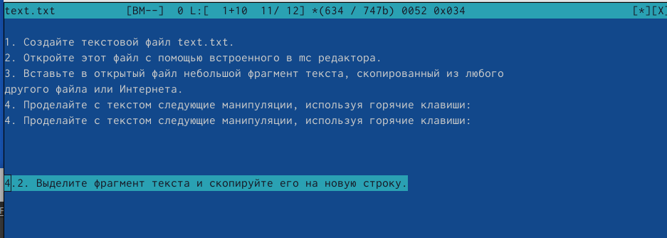{ #fig:028 width=70% }

    - Сохранил файл. (рис. [-@fig:029])
  
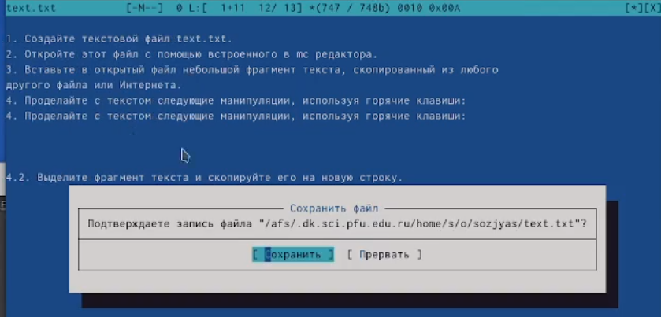{ #fig:029 width=70% }

   - Отменил последнее действие. (рис. [-@fig:030])
  
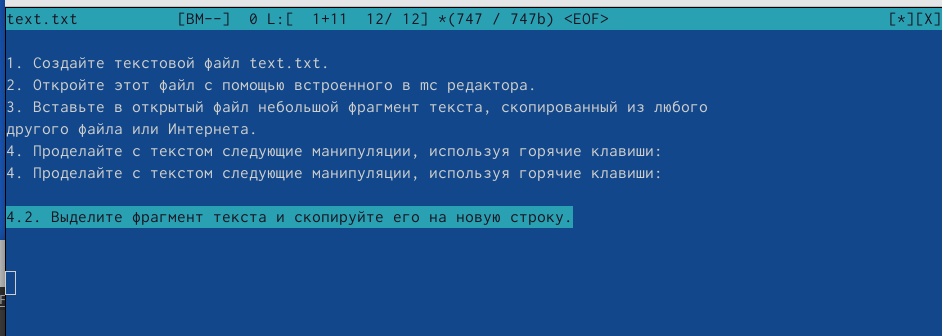{ #fig:030 width=70% }

   - Перешел в конец файла (нажав Ctrl + end) и написал некоторый текст. (рис. [-@fig:031])
  
{ #fig:031 width=70% }

   - Перешел в начало файла (нажав Ctrl + home) и написал некоторый текст. (рис. [-@fig:032])
  
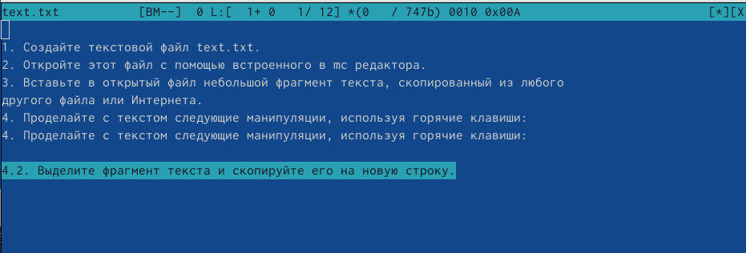{ #fig:032 width=70% }

   - Сохранил и закрыл файл. (рис. [-@fig:033])
  
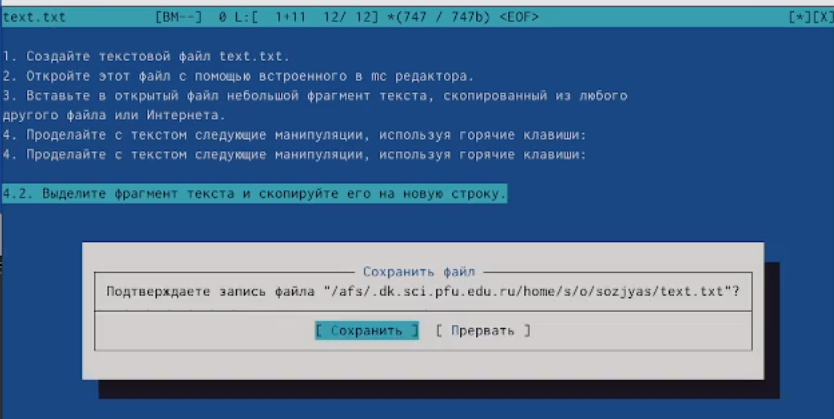{ #fig:033 width=70% }

5. Открыл файл с исходным текстом на языке программирования C рис. [-@fig:034])
  
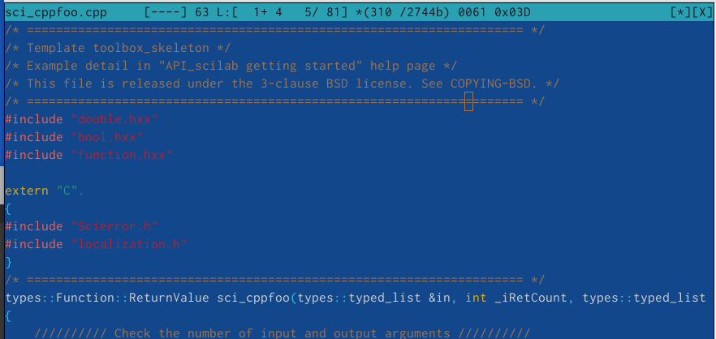{ #fig:034 width=70% }

6. Используя меню редактора, выключил подсветку синтаксиса (рис. [-@fig:035])

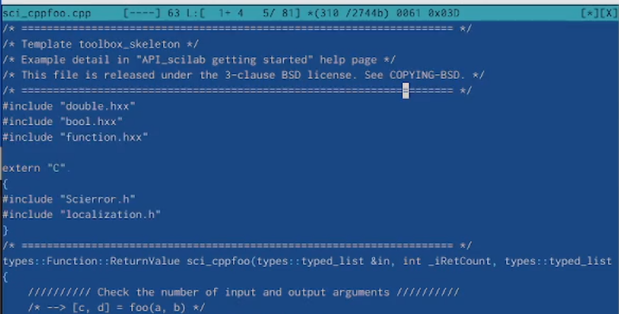{ #fig:035 width=70% }

# Выводы

Я освоил основные возможности командной оболочки Midnight Commander и приобретил навыки практической работы по просмотру каталогов и файлов; манипуляций с ними.

# Контрольные вопросы

   1. Панели могут дополнительно быть переведены в один из двух режимов: Информация или Дерево. В режиме Дерево на одной из панелей выводится структура дерева каталогов. В режиме Информация на панель выводятся сведения о файле и текущей файловой системе, расположенных на активной панели.

   2. В (как и в shell) можно переносить копировать и получать информацию о файлах.

   3. В меню каждой (левой или правой) панели можно выбрать Формат списка (стандартный, ускоренный, расширенный, определённый пользователем) и порядок сортировки, который позволяет задать критерии сортировки при выводе списка файлов и каталогов: без сортировки, по имени, расширенный, время правки, время доступа, время изменения атрибута, размер, узел..

   4. Команды меню Файл : – Просмотр ( F3 ) — позволяет посмотреть содержимое текущего (или выделенного) файла без возможности редактирования. – Просмотр вывода команды ( М + ! ) — функция запроса команды с параметрами (аргумент к текущему выбранному файлу). – Правка ( F4 ) — открывает текущий (или выделенный) файл для его редактирования. – Копирование ( F5 ) — осуществляет копирование одного или нескольких файлов или каталогов в указанное пользователем во всплывающем окне место. – Права доступа ( Ctrl-x c ) — позволяет указать (изменить) права доступа к одному или нескольким файлам или каталогам. – Жёсткая ссылка ( Ctrl-x l ) — позволяет создать жёсткую ссылку к текущему (или выделенному) файлу1. – Символическая ссылка ( Ctrl-x s ) — позволяет создать символическую ссылку к текущему (или выделенному) файлу2. – Владелец/группа ( Ctrl-x o ) — позволяет задать (изменить) владельца и имя группы для одного или нескольких файлов или каталогов. – Права (расширенные) — позволяет изменить права доступа и владения для одного или нескольких файлов или каталогов. – Переименование ( F6 ) — позволяет переименовать (или переместить) один или несколько файлов или каталогов. – Создание каталога ( F7 ) — позволяет создать каталог. – Удалить ( F8 ) — позволяет удалить один или несколько файлов или каталогов. – Выход ( F10 ) — завершает работу .

   5. Команды меню Команда : – Дерево каталогов — отображает структуру каталогов системы. – Поиск файла — выполняет поиск файлов по заданным параметрам. – Переставить панели — меняет местами левую и правую панели. – Сравнить каталоги ( Ctrl-x d ) — сравнивает содержимое двух каталогов. – Размеры каталогов — отображает размер и время изменения каталога (по умолчанию в размер каталога корректно не отображается). – История командной строки — выводит на экран список ранее выполненных воболочке команд. – Каталоги быстрого доступа ( Ctrl-\ ) — пр вызове выполняется быстрая смена текущего каталога на один из заданного списка. – Восстановление файлов — позволяет восстановить файлы на файловых системах ext2 и ext3. – Редактировать файл расширений — позволяет задать с помощью определённого синтаксиса действия при запуске файлов с определённым расширением (например, какое программного обеспечение запускать для открытия или редактирования файлов с расширением doc или docx). – Редактировать файл меню — позволяет отредактировать контекстное меню пользователя, вызываемое по клавише F2 . – Редактировать файл расцветки имён — позволяет подобрать оптимальную для пользователя расцветку имён файлов в зависимости от их типа.

   6. Конфигурация — позволяет скорректировать настройки работы с панелями. – Внешний вид и Настройки панелей — определяет элементы (строка меню, командная строка, подсказки и прочее), отображаемые при вызове , а также геометрию расположения панелей и цветовыделение. – Биты символов — задаёт формат обработки информации локальным терминалом. – Подтверждение — позволяет установить или убрать вывод окна с запросом подтверждения действий при операциях удаления и перезаписи файлов, а также привыходе из программы. – Распознание клавиш — диалоговое окно используется для тестирования функциональных клавиш, клавиш управления курсором и прочее. – Виртуальные ФС –– настройки виртуальной файловой системы: тайм-аут, пароль и прочее.

   7. F1 Вызов контекстно-зависимой подсказки F2 Вызов пользовательского меню с возможностью создания и/или дополнения дополнительных функций F3 Просмотр содержимого файла, на который указывает подсветка в активной панели (без возможности редактирования) F4 Вызов встроенного в редактора для изменения содержания файла, на который указывает подсветка в активной панели F5 Копирование одного или нескольких файлов, отмеченных в первой (активной) панели, в каталог, отображаемый на второй панели F6 Перенос одного или нескольких файлов, отмеченных в первой (ак- тивной) панели, в каталог, отображаемый на второй панели F7 Создание подкаталога в каталоге, отображаемом в активной панели F8 Удаление одного или нескольких файлов (каталогов), отмеченных в первой (активной) панели файлов F9 Вызов меню F10 Выход.

   8. Ctrl-y удалить строку Ctrl-u отмена последней операции Ins вставка/замена F7 поиск (можно использовать регулярные выражения) -F7 повтор последней операции поиска F4 замена F3 первое нажатие — начало выделения, второе — окончание выделения F5 копировать выделенный фрагмент F6 переместить выделенный фрагмент F8 удалить выделенный фрагмент F2 записать изменения в файл F10 выйти из редактора.

   9. Можете сохранить часто используемые команды панелизации под отдельными информативными именами, чтобы иметь возможность их быстро вызвать по этим именам. Для этого нужно набрать команду в строке ввода (строка "Команда") и нажать кнопку Добавить. После этого потребуется ввести имя, по которому мы будем вызывать команду. В следующий раз вам достаточно будет выбрать нужное имя из списка, а не вводить всю команду заново.
   
   
# Список литературы{.unnumbered}

::: {#refs}
:::
