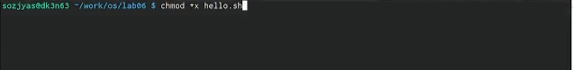
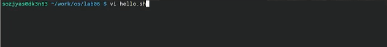

---
## Front matter
title: "**Лабораторная работа № 8.**"
subtitle: "**Текстовой редактор vi**"
author: "**Озьяс Стев Икнэль Дани**"

## Generic otions
lang: ru-RU
toc-title: "Содержание"

## Bibliography
bibliography: bib/cite.bib
csl: pandoc/csl/gost-r-7-0-5-2008-numeric.csl

## Pdf output format
toc: true # Table of contents
toc-depth: 2
lof: true # List of figures
lot: true # List of tables
fontsize: 12pt
linestretch: 1.5
papersize: a4
documentclass: scrreprt
## I18n polyglossia
polyglossia-lang:
  name: russian
  options:
	- spelling=modern
	- babelshorthands=true
polyglossia-otherlangs:
  name: english
## I18n babel
babel-lang: russian
babel-otherlangs: english
## Fonts
mainfont: PT Serif
romanfont: PT Serif
sansfont: PT Sans
monofont: PT Mono
mainfontoptions: Ligatures=TeX
romanfontoptions: Ligatures=TeX
sansfontoptions: Ligatures=TeX,Scale=MatchLowercase
monofontoptions: Scale=MatchLowercase,Scale=0.9
## Biblatex
biblatex: true
biblio-style: "gost-numeric"
biblatexoptions:
  - parentracker=true
  - backend=biber
  - hyperref=auto
  - language=auto
  - autolang=other*
  - citestyle=gost-numeric
## Pandoc-crossref LaTeX customization
figureTitle: "Рис."
tableTitle: "Таблица"
listingTitle: "Листинг"
lofTitle: "Список иллюстраций"
lotTitle: "Список таблиц"
lolTitle: "Листинги"
## Misc options
indent: true
header-includes:
  - \usepackage{indentfirst}
  - \usepackage{float} # keep figures where there are in the text
  - \floatplacement{figure}{H} # keep figures where there are in the text
---

# Цель работы

Цель данной работы --- познакомиться с операционной системой Linux, получить практические навыки работы с редактором vi, установленным по умолчанию практически во всех дистрибутивах.

# Задание

## Задание 1. Создание нового файла с использованием vi
1. Создайте каталог с именем ~/work/os/lab06.
2. Перейдите во вновь созданный каталог.
3. Вызовите vi и создайте файл hello.sh
4. Нажмите клавишу i и вводите следующий текст.
5. Нажмите клавишу Esc для перехода в командный режим после завершения ввода
текста.
6. Нажмите : для перехода в режим последней строки и внизу вашего экрана появится
приглашение в виде двоеточия.
7. Нажмите w (записать) и q (выйти), а затем нажмите клавишу Enter для сохранения
вашего текста и завершения работы.
8. Сделайте файл исполняемым

## Задание 2. Редактирование существующего файла
1. Вызовите vi на редактирование файла
2. Установите курсор в конец слова HELL второй строки.
3. Перейдите в режим вставки и замените на HELLO. Нажмите Esc для возврата в командный режим.
4. Установите курсор на четвертую строку и сотрите слово LOCAL.
5. Перейдите в режим вставки и наберите следующий текст: local, нажмите Esc для
возврата в командный режим.
6. Установите курсор на последней строке файла. Вставьте после неё строку, содержащую
следующий текст: echo $HELLO.
7. Нажмите Esc для перехода в командный режим.
8. Удалите последнюю строку.
9. Введите команду отмены изменений u для отмены последней команды.
10. Введите символ : для перехода в режим последней строки. Запишите произведённые
изменения и выйдите из vi.

# Теоретическое введение

В табл. [-@tbl:std-dir] приведено краткое описание полезных команд для выполнения этой работы.

: Описание некоторых полезных команд для выполнения этой работы {#tbl:std-dir}

|       Команда       |                                                     Действие                                                               |
|---------------------|----------------------------------------------------------------------------------------------------------------------------|
| `G`                 | переход в конец файла                                                                                                      |
| `d w `              | удалить одно слово в буфер                                                                                                 |
| ` d d`              | удалить в буфер одну строку                                                                                                |
| `vi имя файла`      | для вызова редактора vi на редактирование некоторого файла                                                                 |
| `:wq`               | записать изменения в файл и выйти из vi                                                                                    |
| `chmod`             | указать право доступа на некоторый файл и/или каталог                                                                      |
| `mkdir`             | создать каталог                                                                                                            |
| `cd`                | перейти на некоторый каталог                                                                                               |

Более подробно об Unix см. в [@gnu-doc:bash;@newham:2005:bash;@zarrelli:2017:bash;@robbins:2013:bash;@tannenbaum:arch-pc:ru;@tannenbaum:modern-os:ru].

# Выполнение лабораторной работы

## Задание 1. Создание нового файла с использованием vi
   - Я ознакомился с теоретическим материалом.
   - Я ознакомился с редактором vi.

   - Создал каталог с именем ~/work/os/lab06 (рис. [-@fig:001])

{ #fig:001 width=70% }

   - Перешел в каталог ~/work/os/lab06 (рис. [-@fig:002])

{ #fig:002 width=70% }

   - Вызвал vi и создал файл hello.sh (рис. [-@fig:003])

{ #fig:003 width=70% }

   - Нажал клавишу i и вводил данной текст (рис. [-@fig:004])

{ #fig:004 width=70% }

   - Нажал клавишу Esc для перехода в командный режим после завершения ввода
текста. 
   - Нажал : для перехода в режим последней строки.
   - Нажал w (записать) и q (выйти), а затем нажал клавишу Enter для сохранения текста и завершения работы. (рис. [-@fig:005])

{ #fig:005 width=70% }

   - Сделал файл исполняемым (рис. [-@fig:006])

{ #fig:006 width=70% }

## Задание 2. Редактирование существующего файла

   - Вызвал vi на редактирование файла hello.sh (рис. [-@fig:007])

{ #fig:007 width=70% }

   - Установил курсор в конец слова HELL второй строки. (рис. [-@fig:008])

{ #fig:008 width=70% }

   - Перешел в режим вставки и заменил на HELLO. Нажал Esc для возврата в командный режим. (рис. [-@fig:009])

{ #fig:009 width=70% }

   - Установил курсор на четвертую строку и стер слово LOCAL. (рис. [-@fig:010])
   
{ #fig:010 width=70% }

   - Перешел в режим вставки и наберал следующий текст: local, нажал Esc для
возврата в командный режим. (рис. [-@fig:011])

{ #fig:011 width=70% }

   - Установил курсор на последней строке файла с помощью команды G. Вставил после неё строку, содержащую
следующий текст: echo $HELLO. (рис. [-@fig:012])

{ #fig:012 width=70% }

   - Нажал Esc для перехода в командный режим.
   - Удалил последнюю строку. (рис. [-@fig:013])
   
{ #fig:013 width=70% }

   - Ввел команду отмены изменений u для отмены последней команды (рис. [-@fig:014])

{ #fig:014 width=70% }

   - Ввел символ : для перехода в режим последней строки. Записал произведённые
изменения и вышел из vi. (рис. [-@fig:015])

{ #fig:015 width=70% }

# Выводы

Я познакомился с операционной системой Linux и получил практические навыки работы с редактором vi.

# Контрольные вопросы

1. Vi - это интерактивный экранный редактор, который используется для создания и редактирования текстовых файлов. Все действия vi производит в буфере. Произведенные изменения могут быть записаны на диск или отменены. Редактор vi имеет три режима: командный, вставки/ввода и последняя строка.

2. Можно нажимать символ q (или q!), если требуется выйти из редактора без сохранения.

3. Команды позиционирования:
   - 0 (ноль) — переход в начало строки;
   - $ — переход в конец строки;
   - G — переход в конец файла;
   - nG — переход на строку с номером n

4. Редактор vi предполагает, что слово - это строка символов, которая может включать в себя буквы, цифры и символы подчеркивания.

5. G — переход в конец файла и "1G" - переход в начало файла.

6. Команды редактирования:
   - Вставка текста:
   1. а — вставить текст после курсора;
   2. А — вставить текст в конец строки; 
   3. i — вставить текст перед курсором; 
   4. n i - вставить текст n раз; 
   5. I — вставить текст в начало строки.

   - Вставка строки: 
   1. о — вставить строку под курсором; 
   2. О — вставить строку над курсором.

   - Удаление текста: 
   1. x — удалить один символ в буфер; 
   2. d w — удалить одно слово в буфер; 
   3. d $ — удалить в буфер текст от курсора до конца строки; 
   4. d 0 — удалить в буфер текст от начала строки до позиции курсора; 
   5. d d — удалить в буфер одну строку; 
   6. n d d — удалить в буфер n строк.

   - Отмена и повтор произведённых изменений:
   1. u — отменить последнее изменение; 
   2. . — повторить последнее изменение.
    
   - Копирование текста в буфер:
   1. Y — скопировать строку в буфер;
   2. n Y — скопировать n строк в буфер; 
   3. y w — скопировать слово в буфер.

   - Вставка текста из буфера:
   1. p — вставить текст из буфера после курсора; 
   2. P — вставить текст из буфера перед курсором.

   - Замена текста:
   1. c w — заменить слово; 
   2. n c w — заменить n слов; 
   3. c $ — заменить текст от курсора до конца строки; 
   4. r — заменить слово; 
   5. R — заменить текст.

   - Поиск текста:
   1. / текст — произвести поиск вперёд по тексту указанной строки символов текст;
   2. ? текст — произвести поиск назад по тексту указанной строки символов текст.

7. 80 + A + "Символ" + Esc

8. u — отменить последнее изменение

9. Режим последней строки — используется для записи изменений в файл и выхода из редактора.

10. $ — переход в конец строки

11. Опции редактора vi позволяют настроить рабочую среду. Для задания опций используется команда set (в режиме последней строки):
   - : set all — вывести полный список опций;
   - : set nu — вывести номера строк;
   - : set list — вывести невидимые символы;
   - : set ic — не учитывать при поиске, является ли символ прописным или строчным.

12. В редакторе vi есть два основных режима: командный режим и режим вставки. По умолчанию работа начинается в командном режиме. В режиме вставки клавиатура используется для набора текста. Для выхода в командный режим используется клавиша Esc или комбинация Ctrl + c .
   
# Список литературы{.unnumbered}

::: {#refs}
:::
