---
## Front matter
title: "Лабораторная работа № 9."
subtitle: "Текстовой редактор emacs"
author: "ОЗЬЯС Стев Икнэль Дани"

## Generic otions
lang: ru-RU
toc-title: "Содержание"

## Bibliography
bibliography: bib/cite.bib
csl: pandoc/csl/gost-r-7-0-5-2008-numeric.csl

## Pdf output format
toc: true # Table of contents
toc-depth: 2
lof: true # List of figures
lot: true # List of tables
fontsize: 12pt
linestretch: 1.5
papersize: a4
documentclass: scrreprt
## I18n polyglossia
polyglossia-lang:
  name: russian
  options:
	- spelling=modern
	- babelshorthands=true
polyglossia-otherlangs:
  name: english
## I18n babel
babel-lang: russian
babel-otherlangs: english
## Fonts
mainfont: PT Serif
romanfont: PT Serif
sansfont: PT Sans
monofont: PT Mono
mainfontoptions: Ligatures=TeX
romanfontoptions: Ligatures=TeX
sansfontoptions: Ligatures=TeX,Scale=MatchLowercase
monofontoptions: Scale=MatchLowercase,Scale=0.9
## Biblatex
biblatex: true
biblio-style: "gost-numeric"
biblatexoptions:
  - parentracker=true
  - backend=biber
  - hyperref=auto
  - language=auto
  - autolang=other*
  - citestyle=gost-numeric
## Pandoc-crossref LaTeX customization
figureTitle: "Рис."
tableTitle: "Таблица"
listingTitle: "Листинг"
lofTitle: "Список иллюстраций"
lotTitle: "Список таблиц"
lolTitle: "Листинги"
## Misc options
indent: true
header-includes:
  - \usepackage{indentfirst}
  - \usepackage{float} # keep figures where there are in the text
  - \floatplacement{figure}{H} # keep figures where there are in the text
---

# Цель работы

Цель данной работы --- познакомиться с операционной системой Linux. Получить практические навыки работы с редактором Emacs.

# Задание
1. Открыть emacs.
2. Создать файл lab07.sh с помощью комбинации Ctrl-x Ctrl-f (C-x C-f).
3. Наберите текст:
   1. #!/bin/bash
   2. HELL=Hello
   3. function hello {
   4. LOCAL HELLO=World
   5. echo $HELLO
   6. }
   7. echo $HELLO
   8. hello
4. Сохранить файл с помощью комбинации Ctrl-x Ctrl-s (C-x C-s).
5. Проделать с текстом стандартные процедуры редактирования, каждое действие должно осуществляться комбинацией клавиш.
   1. Вырезать одной командой целую строку (С-k).
   2. Вставить эту строку в конец файла (C-y).
   3. Выделить область текста (C-space).
   4. Скопировать область в буфер обмена (M-w).
   5. Вставить область в конец файла.
   6. Вновь выделить эту область и на этот раз вырезать её (C-w).
   7. Отмените последнее действие (C-/).
6. Научитесь использовать команды по перемещению курсора.
   1. Переместите курсор в начало строки (C-a).
   2. Переместите курсор в конец строки (C-e).
   3. Переместите курсор в начало буфера (M-<).
   4. Переместите курсор в конец буфера (M->).
7. Управление буферами.
   1. Вывести список активных буферов на экран (C-x C-b).
   2. Переместитесь во вновь открытое окно (C-x) o со списком открытых буферов переключитесь на другой буфер.
   3. Закройте это окно (C-x 0).
   4. Теперь вновь переключайтесь между буферами, но уже без вывода их списка на экран (C-x b).
8. Управление окнами.
   1. Поделите фрейм на 4 части: разделите фрейм на два окна по вертикали (C-x 3),
   затем каждое из этих окон на две части по горизонтали (C-x 2)
   2. В каждом из четырёх созданных окон откройте новый буфер (файл) и введите несколько строк текста.
9. Режим поиска
   1. Переключитесь в режим поиска (C-s) и найдите несколько слов, присутствующих
   тексте.
   2. Переключайтесь между результатами поиска, нажимая C-s.
   3. Выйдите из режима поиска, нажав C-g.
   4. Перейдите в режим поиска и замены (M-%), введите текст, который следует найти и заменить, нажмите Enter , затем введите текст для замены. После того как будут подсвечены результаты поиска, нажмите ! для подтверждения замены.
   5. Испробуйте другой режим поиска, нажав M-s o. Объясните, чем он отличается от
обычного режима?

# Теоретическое введение

В табл. [-@tbl:std-dir] приведено краткое описание полезных команд для выполнения данной работы.

: Описание полезных команд для выполнения данной работы {#tbl:std-dir}

|    Команда   |                                       Описание действия                                                                    |
|--------------|----------------------------------------------------------------------------------------------------------------------------|
| `C-x C-f`    | Открыть файл                                                                                                               |
| `C-x C-b `   | Отобразить список открытых буферов в новом окне                                                                            |
| `C-x b`      | Переключиться в другой буфер в текущем окне                                                                                |
| `C-x i`      | Вставить содержимое файла в буфер в текущую позицию курсора                                                                |
| `C-x 0`      | Закрыть текущее окно (при этом буфер не удаляется)                                                                         |
| `C-x 1`      | Закрыть все окна кроме текущего                                                                                            |
| `C-x 2`      | Разделить окно по горизонтали                                                                                              |
| `C-x o`      | Перейти в другое окно                                                                                                      |
| `emacs &`    | Запустить emacs в фоновом режиме                                                                                           |
|  `C-x C-s`   | Сохранить текст в буфер                                                                                                    |
Более подробно об Unix см. в [@gnu-doc:bash;@newham:2005:bash;@zarrelli:2017:bash;@robbins:2013:bash;@tannenbaum:arch-pc:ru;@tannenbaum:modern-os:ru].

# Выполнения лабораторной работы

## Основные команды emacs

1. Открыл emacs (рис. [-@fig:001])

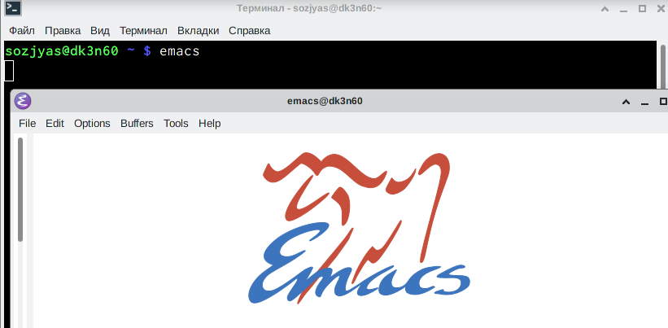{ #fig:001 width=70% }

2. Создал файл lab07.sh с помощью комбинации Ctrl-x Ctrl-f. (рис. [-@fig:002])

{ #fig:002 width=70% }

3. Набрал текст (рис. [-@fig:003])

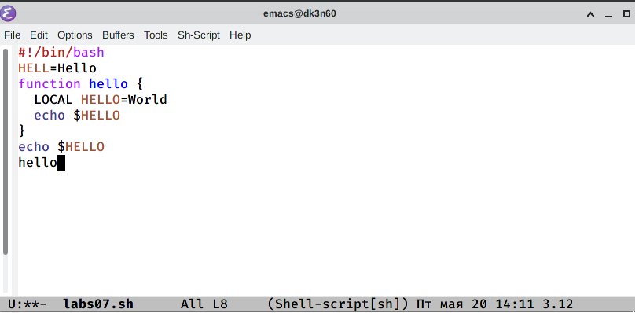{ #fig:003 width=70% }

4. Сохранил файл с помощью комбинации Ctrl-x Ctrl-s.

5. Проделал с текстом стандартные процедуры редактирования, каждое действие должно осуществляться комбинацией клавиш:
   - Вырезал одной командой целую строку(рис. [-@fig:004])

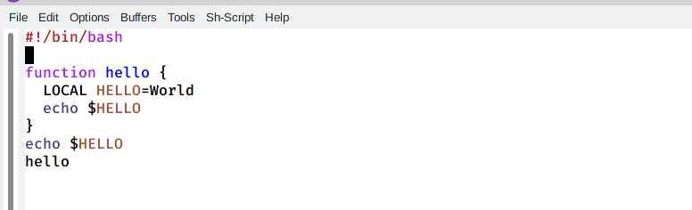{ #fig:004 width=70% }

   - Вставил эту строку в конец файла (C-y).(рис. [-@fig:005]

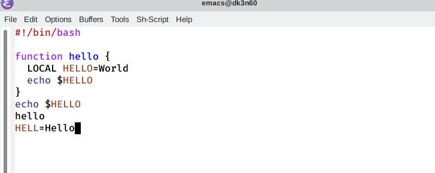{ #fig:005 width=70% }

   - Выделил область текста (C-space).(рис. [-@fig:006]

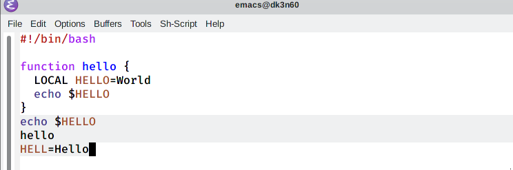{ #fig:006 width=70% }

   - Скопировал область в буфер обмена (M-w)
   - Вставил область в конец файла (рис. [-@fig:007])

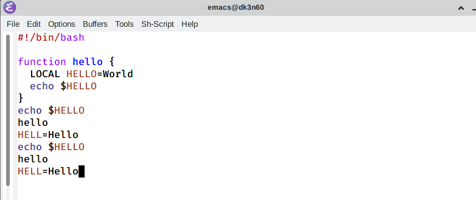{ #fig:007 width=70% }

   - Вновь выделил эту область и на этот раз вырезал её (C-w).(рис. [-@fig:008])

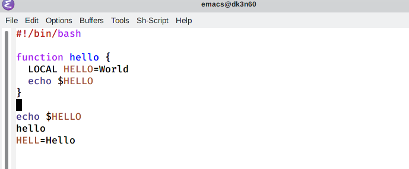{ #fig:008 width=70% }

   - Отменил последнее действие (C-/) (рис. [-@fig:009])

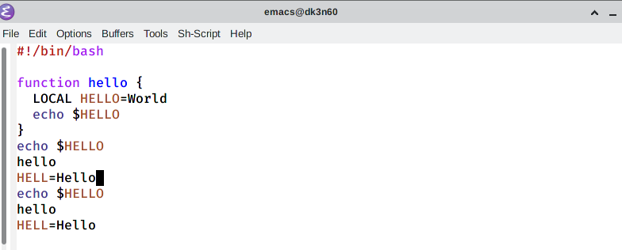{ #fig:009 width=70% }

6. Научился использовать команды по перемещению курсора.
   - Переместил курсор в начало строки (C-a). (рис. [-@fig:010])

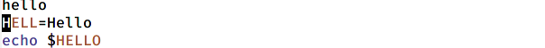{ #fig:010 width=70% }

   - Переместил курсор в конец строки (C-e). (рис. [-@fig:011])

{ #fig:011 width=70% }

   - Переместил курсор в начало буфера (M-<). (рис. [-@fig:012])

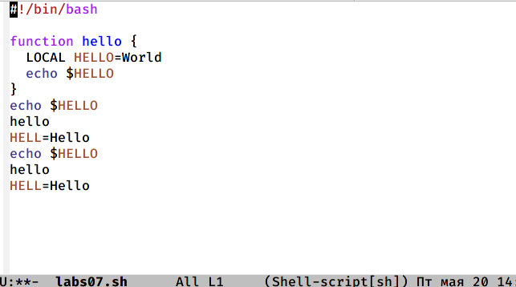{ #fig:012 width=70% }

   - Переместил курсор в конец буфера (рис. [-@fig:013])

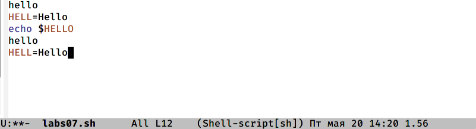{ #fig:013 width=70% }

## Управление буферами

8. Поделил фрейм на 4 части:
   - Разделил фрейм на два окна по вертикали (C-x 3) (рис. [-@fig:018])

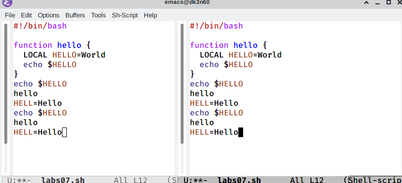{ #fig:018 width=70% }

   - А затем каждое из этих окон на две части по горизонтали (C-x 2) (рис. [-@fig:019])

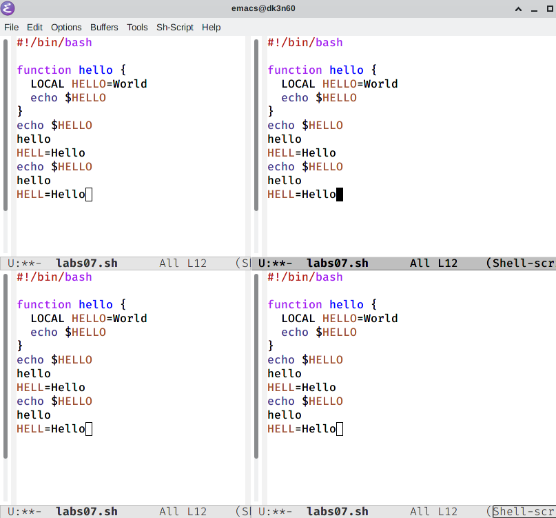{ #fig:019 width=70% }

   - В каждом из четырёх созданных окон открыл новый буфер (файл) и ввел несколько строк текста. (рис. [-@fig:020])

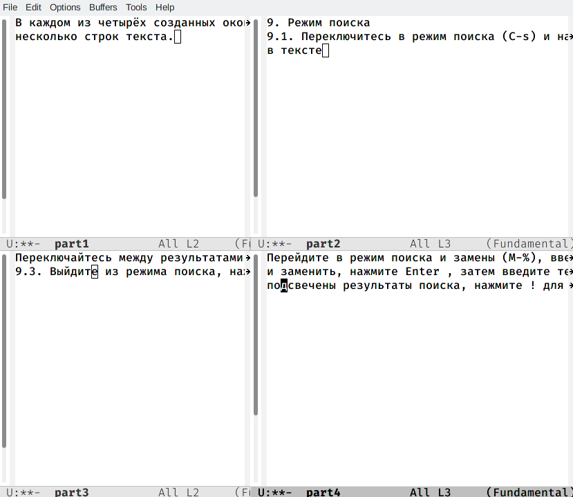{ #fig:020 width=70% }

## Режим поиска

9. Переключился в режим поиска (C-s) и нашел несколько слов, присутствующих в тексте (рис. [-@fig:021])

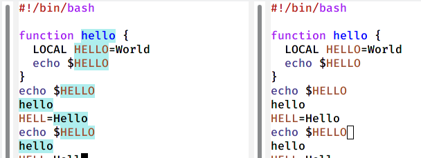{ #fig:021 width=70% }

   - Переключался между результатами поиска, нажимая C-s. (рис. [-@fig:022])

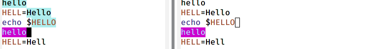{ #fig:022 width=70% }

   - Выйшел из режима поиска, нажав C-g. (рис. [-@fig:023])

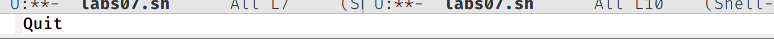{ #fig:023 width=70% }

   - Перешел в режим поиска и замены (M-%), ввел текст, который следует найти и заменить, а затем нажал Enter и ввел текст для замены. После того как были подсвечены результаты поиска, нажал ! для подтверждения замены.(рис. [-@fig:024])

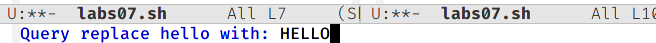{ #fig:024 width=70% }

   - Испробовал другой режим поиска, нажав M-s o. (рис. [-@fig:025])

{ #fig:025 width=70% }

# Выводы

Я познакомился с операционной системой Linux. Получить практические навыки работы с редактором Emacs.

# Контрольные вопросы

   1. Emacs представляет собой мощный экранный редактор текста, написанный на языке высокого уровня Elisp.

   2. Самое проблемное для новичка будет - это большое количество горячих клавишей, их больше чем в Vim.

   3. Буфер — объект, представляющий какой-либо текст. Окно — прямоугольная область фрейма, отображающая один из буферов.

   4. Можно, но кто будет использовать столько буферов в одном окне. Это неудобно.

   5. Emacs использует буферы с именами, начинающимися с пробела, для внутренних целей. Отчасти он обращается с буферами с такими именами особенным образом -- например, по умолчанию в них не записывается информация для отмены изменений

   6. Ctrl + c, а потом | и Ctrl + c Ctrl + |

   7. Разделите фрейм на два окна по вертикали(C-x 3), а затем каждое из этих окон на две части по горизонтали (C-x 2).

   8. Настройки emacs хранятся в файле . emacs, который хранится в домашней дирректории пользователя. Кроме этого файла есть ещё папка . emacs.

   9. Клавиша <- или Backspace удаляет букву или выделенный отрезок. Её нельзя заменить без последствий, так как она зашита в систему.

   10. Понравился больше Vim, потому что он более проще чем emacs, не требует пользования мышкой, как иногда многие IDE в том числе emacs и при правильной настройки Vim становится грозой для большинства IDE редакторов.

# Список литературы{.unnumbered}

::: {#refs}
:::
