---
## Front matter
title: "Лабораторная работа №13."
subtitle: "Средства, применяемые при разработке программного обеспечения в ОС типа UNIX/Linux"
author: "ОЗЬЯС Стев Икнэль Дани"

## Generic otions
lang: ru-RU
toc-title: "Содержание"

## Bibliography
bibliography: bib/cite.bib
csl: pandoc/csl/gost-r-7-0-5-2008-numeric.csl

## Pdf output format
toc: true # Table of contents
toc-depth: 2
lof: true # List of figures
lot: true # List of tables
fontsize: 12pt
linestretch: 1.5
papersize: a4
documentclass: scrreprt
## I18n polyglossia
polyglossia-lang:
  name: russian
  options:
	- spelling=modern
	- babelshorthands=true
polyglossia-otherlangs:
  name: english
## I18n babel
babel-lang: russian
babel-otherlangs: english
## Fonts
mainfont: PT Serif
romanfont: PT Serif
sansfont: PT Sans
monofont: PT Mono
mainfontoptions: Ligatures=TeX
romanfontoptions: Ligatures=TeX
sansfontoptions: Ligatures=TeX,Scale=MatchLowercase
monofontoptions: Scale=MatchLowercase,Scale=0.9
## Biblatex
biblatex: true
biblio-style: "gost-numeric"
biblatexoptions:
  - parentracker=true
  - backend=biber
  - hyperref=auto
  - language=auto
  - autolang=other*
  - citestyle=gost-numeric
## Pandoc-crossref LaTeX customization
figureTitle: "Рис."
tableTitle: "Таблица"
listingTitle: "Листинг"
lofTitle: "Список иллюстраций"
lotTitle: "Список таблиц"
lolTitle: "Листинги"
## Misc options
indent: true
header-includes:
  - \usepackage{indentfirst}
  - \usepackage{float} # keep figures where there are in the text
  - \floatplacement{figure}{H} # keep figures where there are in the text
---

# Цель работы

Цель данной работы --- приобрести простейшие навыки разработки, анализа, тестирования и отладки приложений в ОС типа UNIX/Linux на примере создания на языке программирования С калькулятора с простейшими функциями.

# Задание

1. В домашнем каталоге создайте подкаталог ~/work/os/lab_prog.
2. Создайте в нём файлы: calculate.h, calculate.c, main.c. Это будет примитивнейший калькулятор, способный складывать, вычитать, умножать и делить, возводить число в степень, брать квадратный корень, вычислять sin, cos, tan. При запуске он будет запрашивать первое число, операцию, второе число. После этого программа выведет результат и остановится. Реализация функций калькулятора в файле calculate.h, интерфейсный файл calculate.h, описывающий формат вызова функциикалькулятора, основной файл main.c, реализующий интерфейс пользователя к калькулятору.
3. Выполните компиляцию программы посредством gcc:
   - gcc -c calculate.c
   - gcc -c main.c
   - gcc calculate.o main.o -o calcul -lm
4. При необходимости исправьте синтаксические ошибки.
5. Создайте Makefile с заданным содержанием. Поясните в отчёте его содержание.
6. С помощью gdb выполните отладку программы calcul (перед использованием gdb исправьте Makefile):
   - Запустите отладчик GDB, загрузив в него программу для отладки:
     - gdb ./calcul
   - Для запуска программы внутри отладчика введите команду run:
     - run
   - Для постраничного (по 9 строк) просмотра исходного код используйте команду list:
     - list
   - Для просмотра строк с 12 по 15 основного файла используйте list с параметрами:
     - list 12,15
   - Для просмотра определённых строк не основного файла используйте list с параметрами:
     - list calculate.c:20,29
   - Установите точку останова в файле calculate.c на строке номер 21:
     - list calculate.c:20,27
     - break 21
   - Выведите информацию об имеющихся в проекте точка останова:
     - info breakpoints
   - Запустите программу внутри отладчика и убедитесь, что программа остановится в момент прохождения точки останова:
     - run
     - 5
     - backtrace
   - Отладчик выдаст следующую информацию:
     - #0 Calculate (Numeral=5, Operation=0x7fffffffd280 "-")
     - at calculate.c:21
     - #1 0x0000000000400b2b in main () at main.c:17
   - А команда backtrace покажет весь стек вызываемых функций от начала программы до текущего места.
   - Посмотрите, чему равно на этом этапе значение переменной Numeral, введя:
     - print Numeral
   - На экран должно быть выведено число 5.
   - Сравните с результатом вывода на экран после использования команды:
     - display Numeral
   - Уберите точки останова:
     - info breakpoints
     - delete 1
7. С помощью утилиты splint попробуйте проанализировать коды файлов calculate.c и main.c.

# Теоретическое введение

   - Процесс разработки программного обеспечения обычно разделяется на следующие этапы:
     - планирование, включающее сбор и анализ требований к функционалу и другим характеристикам разрабатываемого приложения;
     - проектирование, включающее в себя разработку базовых алгоритмов и спецификаций, определение языка программирования;
     - непосредственная разработка приложения:
     - кодирование — по сути создание исходного текста программы (возможно в нескольких вариантах);
     - анализ разработанного кода;
     - сборка, компиляция и разработка исполняемого модуля;
     - тестирование и отладка, сохранение произведённых изменений;
     - документирование.
   - Для создания исходного текста программы разработчик может воспользоваться любым
удобным для него редактором текста: vi, vim, mceditor, emacs, geany и др.
   - После завершения написания исходного кода программы (возможно состоящей из
нескольких файлов), необходимо её скомпилировать и получить исполняемый модуль.

   - В табл. [-@tbl:std-dir] приведено краткое описание полезных для выполнения работы команд и клавиш.

: Описание полезных для выполнения работы команд {#tbl:std-dir}

|Команда               |     Описание действия                                                                                                      |
|----------------------|----------------------------------------------------------------------------------------------------------------------------|
| `backtrace`          | вывод на экран пути к текущей точке останова (по сути вывод названий всех функций)                                         |
| `break `             | установить точку останова (в качестве параметра может быть указан номер строки или название функции)                       |
| `continue`           | продолжить выполнение программы                                                                                            |
| `info breakpoints `  | вывести на экран список используемых точек останова                                                                        |
| `delete`             | удалить точку останова                                                                                                     |
| `list `              | вывести на экран исходный код                                                                                              |
| `run`                | запуск программы на выполнение                                                                                             |

   - Более подробно об Unix см. в [@gnu-doc:bash;@newham:2005:bash;@zarrelli:2017:bash;@robbins:2013:bash;@tannenbaum:arch-pc:ru;@tannenbaum:modern-os:ru].

# Выполнение лабораторной работы

1. В домашнем каталоге создал подкаталог ~/work/os/lab_prog. (рис. [-@fig:001])

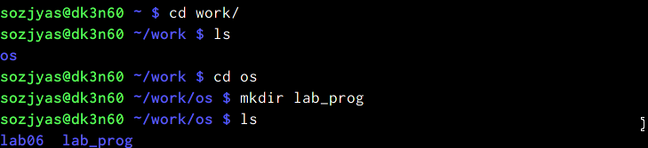{ #fig:001 width=70% }

2. Создал в нём файлы: calculate.h, calculate.c, main.c. (рис. [-@fig:002])

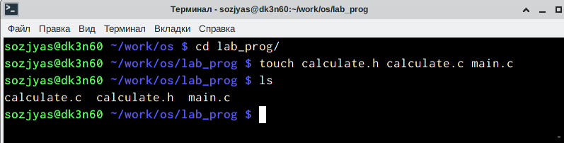{ #fig:002 width=70% }

   - calculate.h, (рис. [-@fig:003])

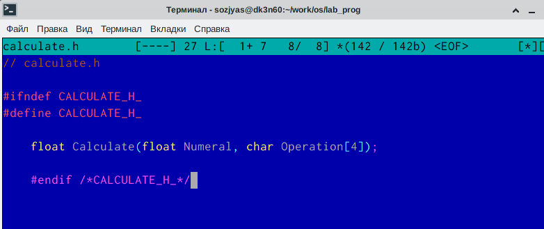{ #fig:003 width=70% }

   - calculate.c, (рис. [-@fig:004])

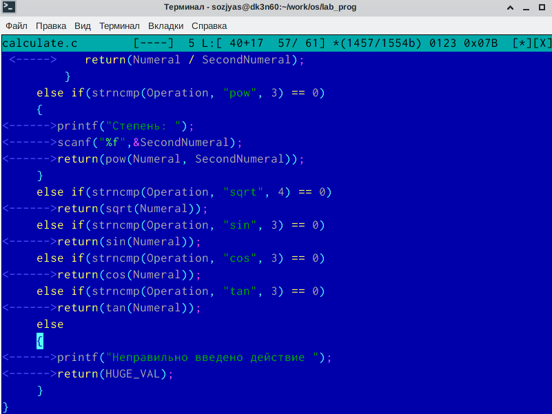{ #fig:004 width=70% }

   - main.c (рис. [-@fig:005]

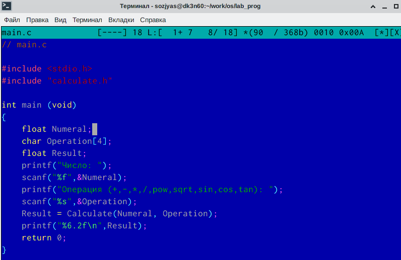{ #fig:005 width=70% }

3. Выполнил компиляцию программы посредством gcc (рис. [-@fig:006])

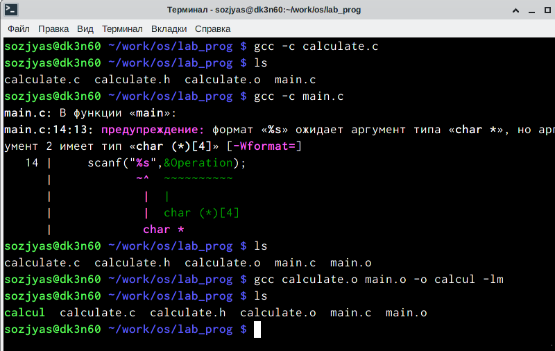{ #fig:006 width=70% }

4. Я исправил незначительную синтаксическую ошибку.

5. Создал Makefile с заданным содержанием (рис. [-@fig:007])
   - CC = gcc замена слова gcc на CC
   - LIBS = -lm дополнительные опции
   - calcul: calculate.o main.o
     - gcc calculate.o main.o -o calcul $(LIBS)  команда для создания исполдняемого файла calcul
   - calculate.o: calculate.c calculate.h
     - gcc -c calculate.c $(CFLAGS)  команда для создания объектного файла calculate.o
   - main.o: main.c calculate.h
     - gcc -c main.c $(CFLAGS)  команда для создания объектного файла main.o
   - clean:
     - -rm calcul *.o *~  команда для удаления всех объектных файлов и  файлов с знаком ~ в конец

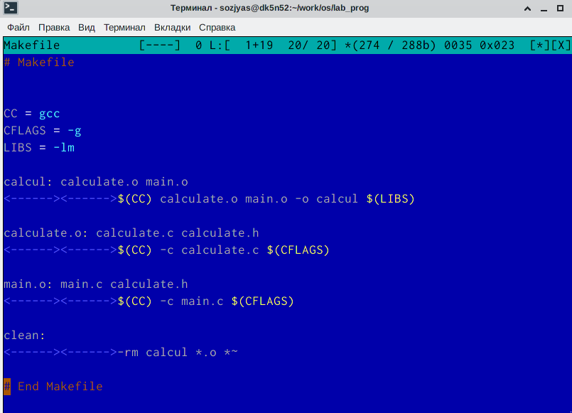{ #fig:007 width=70% }

6. С помощью gdb выполнил отладку программы calcul (перед использованием gdb исправил Makefile)(рис. [-@fig:008]

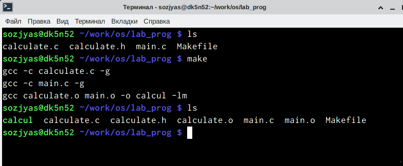{ #fig:008 width=70% }

   - Запустил отладчик GDB, загрузив в него программу для отладки:(рис. [-@fig:009]

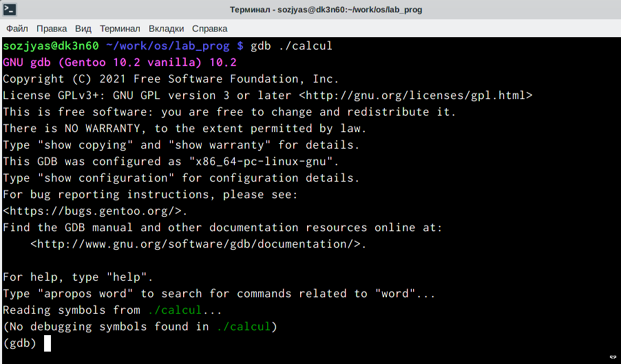{ #fig:009 width=70% }

   - Запустил программу внутри отладчика (рис. [-@fig:010])

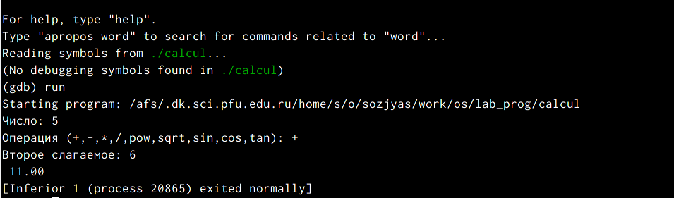{ #fig:010 width=70% }

   - Просмотрел исходный код используя команду list (рис. [-@fig:011])

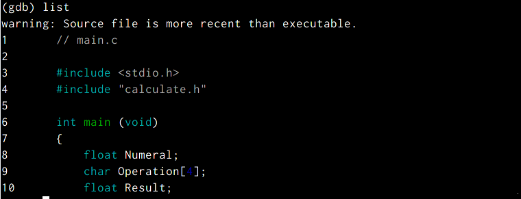{ #fig:011 width=70% }

   - Просмотрел строки с 12 по 15 основного файла (рис. [-@fig:012])

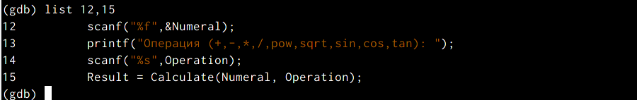{ #fig:012 width=70% }

   - Просмотрел определённые строки не основного файла (рис. [-@fig:013])

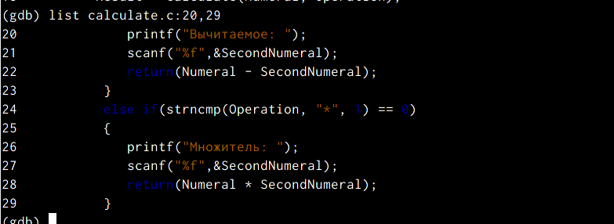{ #fig:013 width=70% }

   - Установил точку останова в файле calculate.c на строке номер 21: (рис. [-@fig:014])

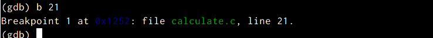{ #fig:014 width=70% }

   - Вывел информацию об имеющихся в проекте точка останова: (рис. [-@fig:015])

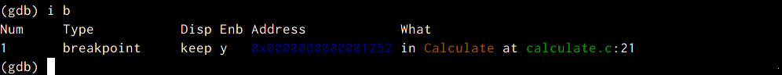{ #fig:015 width=70% }

   - Запустил программу внутри отладчика и убедился, что программа остановился в момент прохождения точки останова: (рис. [-@fig:016])

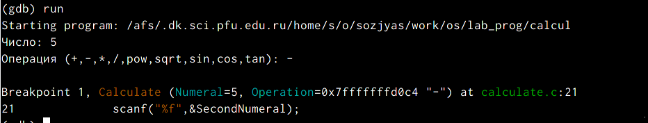{ #fig:016 width=70% }

   - backtrace (рис. [-@fig:017])

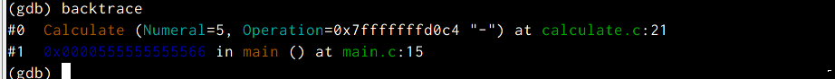{ #fig:017 width=70% }

   - Посмотрел, чему равно на этом этапе значение переменной Numeral (рис. [-@fig:018])

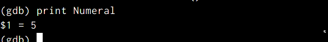{ #fig:018 width=70% }

   - Сравнил с результатом вывода на экран (рис. [-@fig:019])

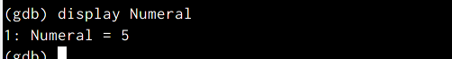{ #fig:019 width=70% }

   - Убрал точку останова: (рис. [-@fig:020])

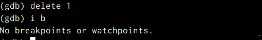{ #fig:020 width=70% }

7. С помощью утилиты splint попробуйте проанализировал коды файлов:
   - calculate.c (рис. [-@fig:021])

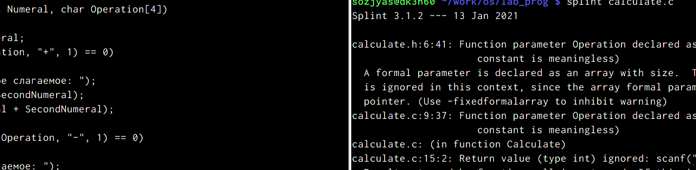{ #fig:021 width=70% }

   - и main.c. (рис. [-@fig:022])

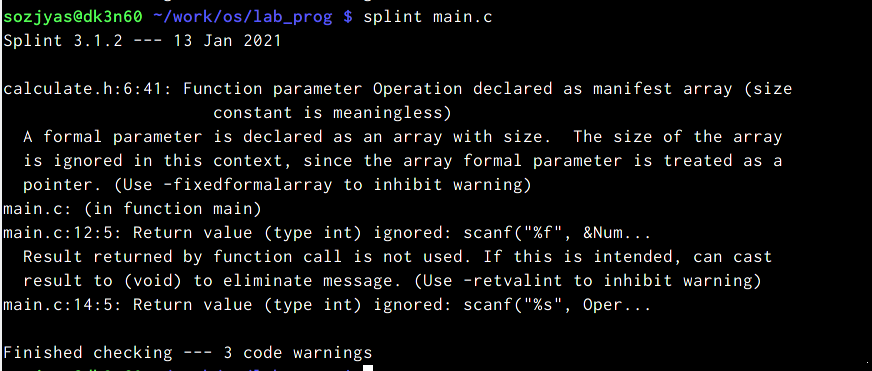{ #fig:022 width=70% }

# Выводы

   - Я приобретил простейшие навыки разработки, анализа, тестирования и отладки приложений в ОС типа UNIX/Linux на примере создания на языке программирования С калькулятора с простейшими функциями.

# Контрольные вопросы

1. Получить информацию о возможностях программ gcc, make, gdb и др. можно с помощью команд man.
2. Процесс разработки программного обеспечения обычно разделяется на следующие этапы:
     - планирование, включающее сбор и анализ требований к функционалу и другим характеристикам разрабатываемого приложения;
     - проектирование, включающее в себя разработку базовых алгоритмов и спецификаций, определение языка программирования;
     - непосредственная разработка приложения:
     - кодирование — по сути создание исходного текста программы (возможно в нескольких вариантах);
     - анализ разработанного кода;
     - сборка, компиляция и разработка исполняемого модуля;
     - тестирование и отладка, сохранение произведённых изменений;
     - документирование.
   - Для создания исходного текста программы разработчик может воспользоваться любым
удобным для него редактором текста: vi, vim, mceditor, emacs, geany и др.
   - После завершения написания исходного кода программы (возможно состоящей из
нескольких файлов), необходимо её скомпилировать и получить исполняемый модуль.

3. Суффикс в контексте языка программирования означает расширение файла программы.
     - Пример исползования - gcc -c main.c

4. Компилятор языка С в UNIX предназначен для сборки разрабатываемой программы, написанной на языке С.

5. Она позволяет автоматизировать процесс преобразования файлов программы из одной формы в другую, отслеживает взаимосвязи между файлами.

6. Пример структуры Makefile
     - hello: main.c
     - gcc -o hello main.c

7. Любой отладчик имеет способность поискать и устранять ошибки в программе. Для его использования необходимо скомпилировать анализируемый код программы таким образом, чтобы отладочная информация содержалась в результирующем бинарном файле.

8. Основные команды GDB

|Команда               |     Описание действия                                                                                                      |
|----------------------|----------------------------------------------------------------------------------------------------------------------------|
| `backtrace`          | вывод на экран пути к текущей точке останова (по сути вывод названий всех функций)                                         |
| `break `             | установить точку останова (в качестве параметра может быть указан номер строки или название функции)                       |
| `continue`           | продолжить выполнение программы                                                                                            |
| `info breakpoints `  | вывести на экран список используемых точек останова                                                                        |
| `delete`             | удалить точку останова                                                                                                     |
| `list `              | вывести на экран исходный код                                                                                              |
| `run`                | запуск программы на выполнение                                                                                             |

9. Опысание схемы отладки
   - calcul: calculate.o main.o
     - gcc calculate.o main.o -o calcul $(LIBS)  команда для создания исполдняемого файла calcul
   - calculate.o: calculate.c calculate.h
     - gcc -c calculate.c $(CFLAGS)  команда для создания объектного файла calculate.o
   - main.o: main.c calculate.h
     - gcc -c main.c $(CFLAGS)  команда для создания объектного файла main.o

10. Он обнаруживает синтаксические и семантические ошибки.
11. Основные средства, повышающие понимание исходного кода программы - GDB и splint.
12. Splint анализирует программный код, проверяет корректность задания аргументов использованных в программе функций и типов возвращаемых
значений, обнаруживает синтаксические и семантические ошибки.

# Список литературы{.unnumbered}

::: {#refs}
:::
