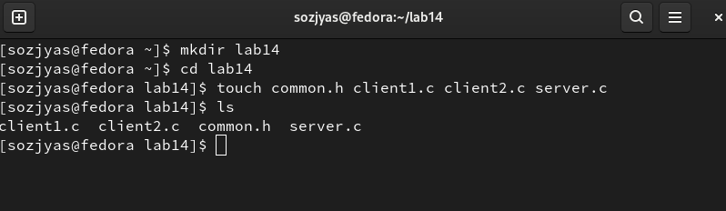
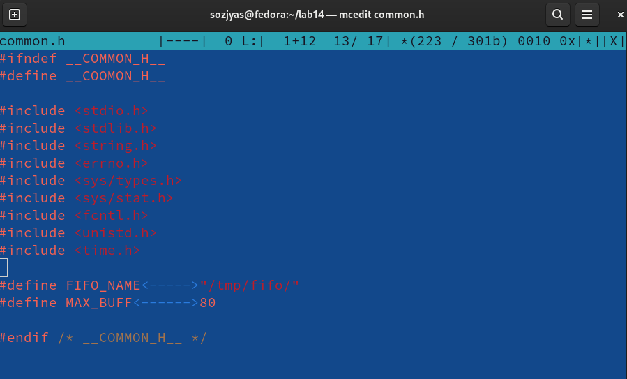
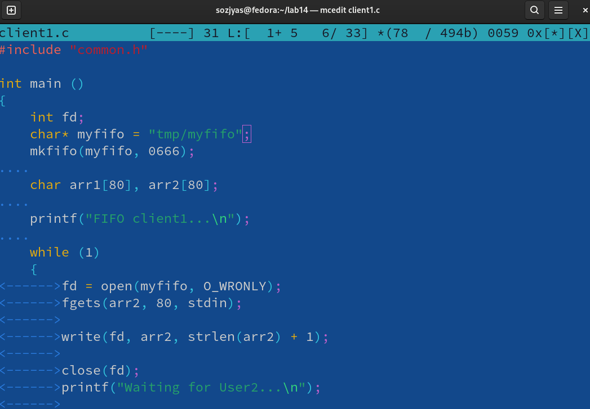
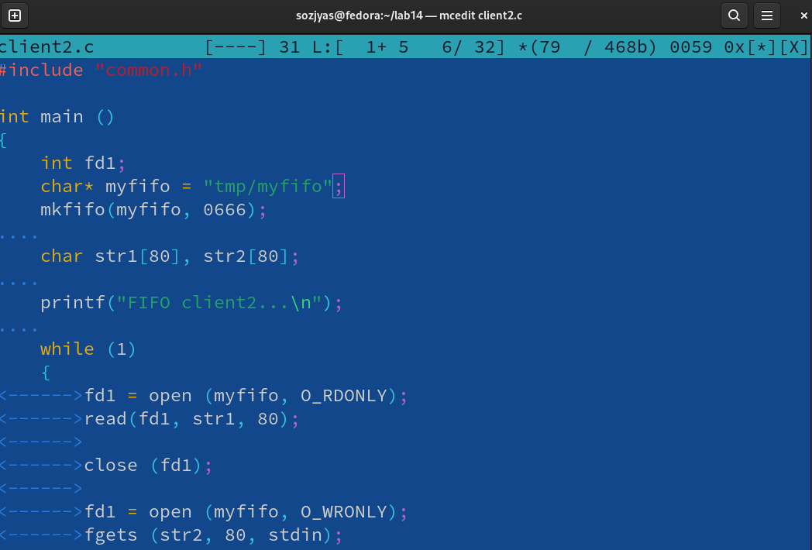
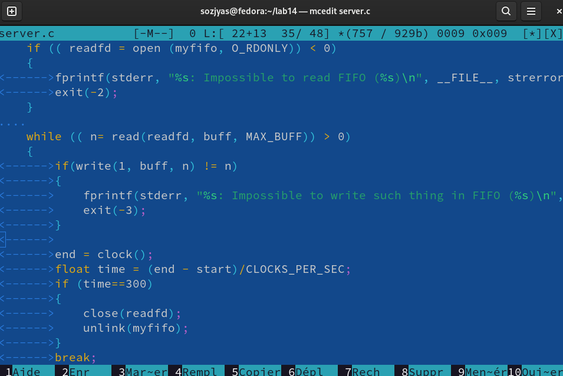

---
## Front matter
title: "Лабораторная работа"
subtitle: "Именованные каналы"
author: "ОЗЬЯС Стев Икнэль Дани"

## Generic otions
lang: ru-RU
toc-title: "Содержание"

## Bibliography
bibliography: bib/cite.bib
csl: pandoc/csl/gost-r-7-0-5-2008-numeric.csl

## Pdf output format
toc: true # Table of contents
toc-depth: 2
lof: true # List of figures
lot: true # List of tables
fontsize: 12pt
linestretch: 1.5
papersize: a4
documentclass: scrreprt
## I18n polyglossia
polyglossia-lang:
  name: russian
  options:
	- spelling=modern
	- babelshorthands=true
polyglossia-otherlangs:
  name: english
## I18n babel
babel-lang: russian
babel-otherlangs: english
## Fonts
mainfont: PT Serif
romanfont: PT Serif
sansfont: PT Sans
monofont: PT Mono
mainfontoptions: Ligatures=TeX
romanfontoptions: Ligatures=TeX
sansfontoptions: Ligatures=TeX,Scale=MatchLowercase
monofontoptions: Scale=MatchLowercase,Scale=0.9
## Biblatex
biblatex: true
biblio-style: "gost-numeric"
biblatexoptions:
  - parentracker=true
  - backend=biber
  - hyperref=auto
  - language=auto
  - autolang=other*
  - citestyle=gost-numeric
## Pandoc-crossref LaTeX customization
figureTitle: "Рис."
tableTitle: "Таблица"
listingTitle: "Листинг"
lofTitle: "Список иллюстраций"
lotTitle: "Список таблиц"
lolTitle: "Листинги"
## Misc options
indent: true
header-includes:
  - \usepackage{indentfirst}
  - \usepackage{float} # keep figures where there are in the text
  - \floatplacement{figure}{H} # keep figures where there are in the text
---

# Цель работы

Цель данной работы --- приобретение практических навыков работы с именованными каналами.

# Выполнение лабораторной работы

1. Изучил приведённые в тексте программы server.c и client.c. Взяв данные примеры за образец, напишите аналогичные программы, внеся следующие изменения:
   - Работает не 1 клиент, а несколько (например, два).(рис. [-@fig:001])

{ #fig:001 width=70% }

# Client1.c

   - common.h (рис. [-@fig:002])

{ #fig:002 width=70% }
   

   - Клиенты передают текущее время с некоторой периодичностью (например, раз в пять секунд). (рис. [-@fig:003])

{ #fig:003 width=70% }

# Client2.c

   - Использовал функцию sleep() для приостановки работы клиента. (рис. [-@fig:004])

{ #fig:004 width=70% }

# Server.c

   - Сервер работает не бесконечно, а прекращает работу через некоторое время (например, 30 сек). Использовал функцию clock() для определения времени работы сервера. (рис. [-@fig:005])

{ #fig:005 width=70% }

# Выводы

Я приобретил практических навыков работы с именованными каналами.

# Контрольные вопросы

# Список литературы{.unnumbered}

::: {#refs}
:::
