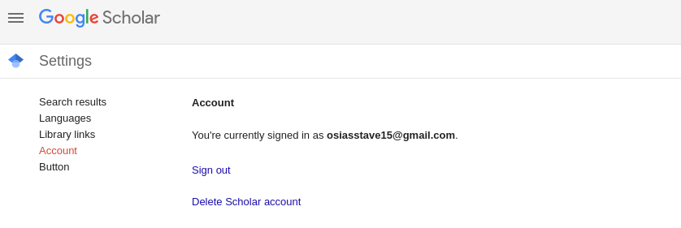
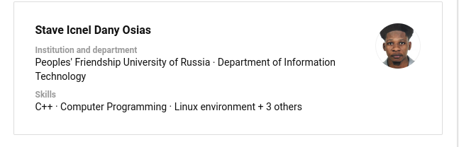

---
## Front matter
title: "РОССИЙСКИЙ УНИВЕРСИТЕТ ДРУЖБЫ НАРОДОВ"
subtitle: "Индивидуальный проект. Этап №4"
author: "ОЗЬЯС Стев Икнэль Дани"

## Generic otions
lang: ru-RU
toc-title: "Содержание"

## Bibliography
bibliography: bib/cite.bib
csl: pandoc/csl/gost-r-7-0-5-2008-numeric.csl

## Pdf output format
toc: true # Table of contents
toc-depth: 2
lof: true # List of figures
lot: true # List of tables
fontsize: 12pt
linestretch: 1.5
papersize: a4
documentclass: scrreprt
## I18n polyglossia
polyglossia-lang:
  name: russian
  options:
	- spelling=modern
	- babelshorthands=true
polyglossia-otherlangs:
  name: english
## I18n babel
babel-lang: russian
babel-otherlangs: english
## Fonts
mainfont: PT Serif
romanfont: PT Serif
sansfont: PT Sans
monofont: PT Mono
mainfontoptions: Ligatures=TeX
romanfontoptions: Ligatures=TeX
sansfontoptions: Ligatures=TeX,Scale=MatchLowercase
monofontoptions: Scale=MatchLowercase,Scale=0.9
## Biblatex
biblatex: true
biblio-style: "gost-numeric"
biblatexoptions:
  - parentracker=true
  - backend=biber
  - hyperref=auto
  - language=auto
  - autolang=other*
  - citestyle=gost-numeric
## Pandoc-crossref LaTeX customization
figureTitle: "Рис."
tableTitle: "Таблица"
listingTitle: "Листинг"
lofTitle: "Список иллюстраций"
lotTitle: "Список таблиц"
lolTitle: "Листинги"
## Misc options
indent: true
header-includes:
  - \usepackage{indentfirst}
  - \usepackage{float} # keep figures where there are in the text
  - \floatplacement{figure}{H} # keep figures where there are in the text
---

# Цель работы

Цель работы --- добавить к сайту ссылки на научные и библиометрические ресурсы.

# Задание

1. Зарегистрироваться на соответствующих ресурсах и разместить на них ссылки на сайте:
   - eLibrary : https://elibrary.ru/;
   - Google Scholar : https://scholar.google.com/;
   - ORCID : https://orcid.org/;
   - Mendeley : https://www.mendeley.com/;
   - ResearchGate : https://www.researchgate.net/;
   - Academia.edu : https://www.academia.edu/;
   - arXiv : https://arxiv.org/;
   - github : https://github.com/.
2. Сделать пост по прошедшей неделе.
3. Добавить пост на тему по выбору:
   - Оформление отчёта.
   - Создание презентаций.
   - Работа с библиографией.

## Выполнение

   - Я зарегистрировался на соответствующих ресурсах и разместить на них ссылки на сайте:
   
   - eLibrary : https://elibrary.ru/; (рис. [-@fig:001])

{ #fig:001 width=70% }

   - Google Scholar : https://scholar.google.com/; (рис. [-@fig:002])

{ #fig:002 width=70% }

   - ORCID : https://orcid.org/; (рис. [-@fig:003])

{ #fig:003 width=70% }

   - Mendeley : https://www.mendeley.com/; (рис. [-@fig:004])

{ #fig:004 width=70% }

   - ResearchGate : https://www.researchgate.net/; (рис. [-@fig:005])

{ #fig:005 width=70% }

   - Academia.edu : https://www.academia.edu/; (рис. [-@fig:006])

{ #fig:006 width=70% }

   - arXiv : https://arxiv.org/; (рис. [-@fig:007])

{ #fig:007 width=70% }

   - Затем я разместил на них ссылки на сайте (рис. [-@fig:008])

{ #fig:008 width=70% }

   - Сделал пост (рис. [-@fig:009])

{ #fig:009 width=70% }

# Выводы

Я научился разместить на научных и библиометрических ресурсах ссылки на сайте.

# Список литературы{.unnumbered}

::: {#refs}
:::
